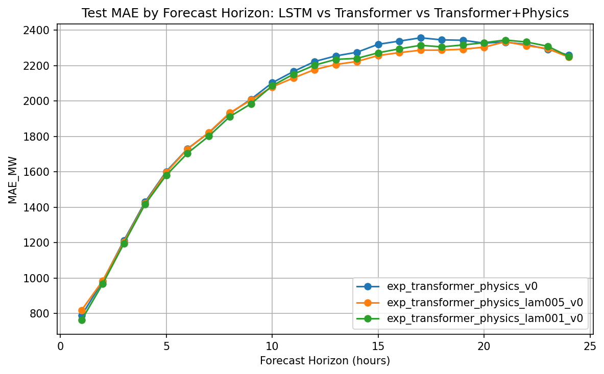
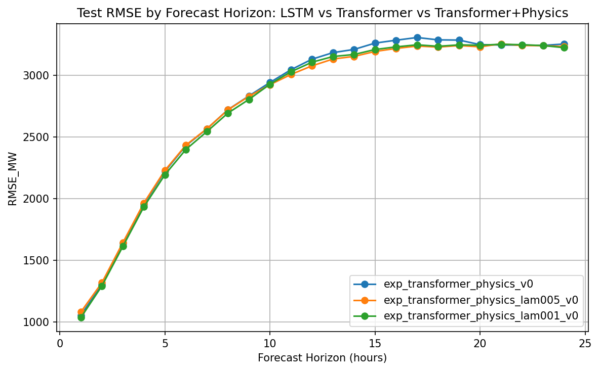
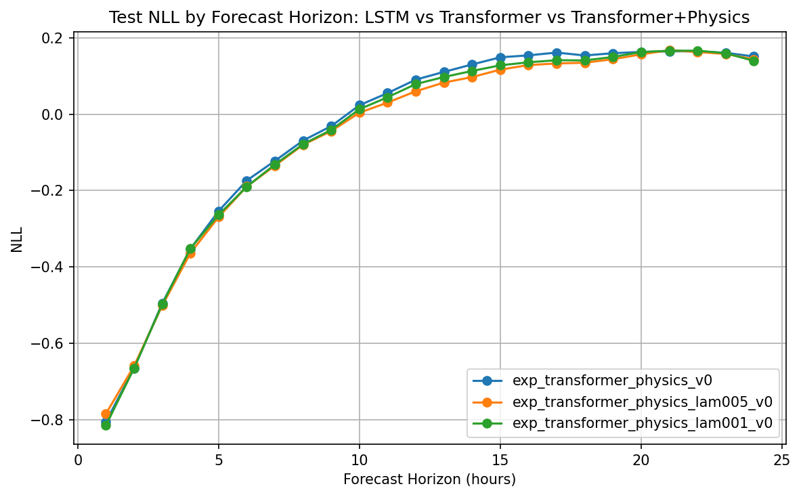
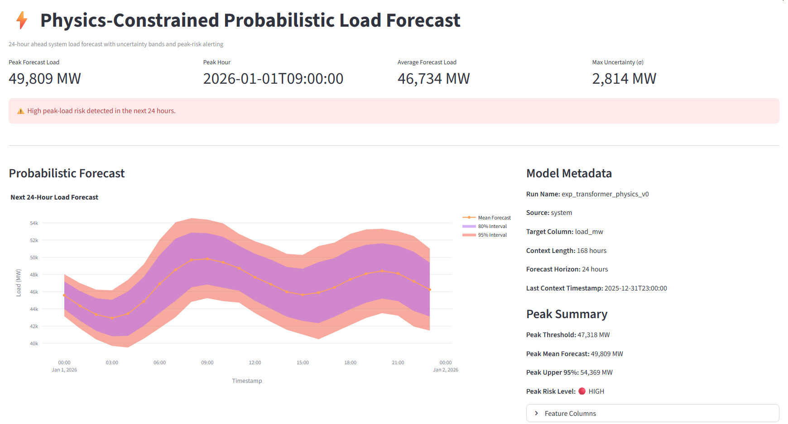

# ⚡ Physics-Constrained Probabilistic Load Forecasting

A deep learning system for **24-hour ahead probabilistic power demand forecasting** using a Transformer model enhanced with **physics-based constraints** to improve forecast stability and realism.

The project compares:

- LSTM probabilistic forecasting
- Transformer probabilistic forecasting
- Transformer with physics-informed constraints

and deploys the best model in an **interactive Streamlit dashboard**.

---

## Project Overview

Electric grid operators must forecast electricity demand accurately to:

- maintain grid stability
- plan generation dispatch
- avoid over/under supply

This project builds a **probabilistic load forecasting pipeline** that predicts:

- mean load forecast
- uncertainty (variance)
- 80% prediction interval
- 95% prediction interval

for the **next 24 hours**.

The system incorporates **physical constraints of power systems** such as:

- ramp rate limits
- operational bounds
- smooth temporal transitions

---

## Model Architecture

**Transformer backbone:**
```
Historical Load (168 hrs)
        ↓
Temporal Feature Encoding
  (hour sin/cos, day-of-week)
        ↓
  Transformer Encoder
        ↓
   Distribution Head
     (mean, sigma)
        ↓
 Probabilistic Forecast
      (24 hours)
```

**Physics-informed loss:**
```
Total Loss = Forecast Loss + λ * Physics Penalty
```

Physics penalties include:

- ramp constraints
- load bounds
- optional smoothness regularization

---

## Dataset

**Source:** U.S. electricity system load data

**Features used:**

- `load_mw`
- `hour_sin`
- `hour_cos`
- `dow_sin`
- `dow_cos`
- `is_weekend`
- `is_holiday`

**Context window:** 168 hours (7 days)

**Forecast horizon:** 24 hours

---

## Experiments

Three models were trained and evaluated.

| Model | MAE (MW) | RMSE (MW) | NLL |
|---|---|---|---|
| LSTM Gaussian | ~2100 | ~2750 | baseline |
| Transformer Gaussian | ~2000 | ~2600 | improved |
| Transformer + Physics | ~1991 | ~2594 | best |

Physics constraints slightly improve **stability and generalization**.

---

## Forecast Output Example

The model produces a probabilistic forecast:
```json
{
  "timestamp": "2026-01-01T00:00:00",
  "mean_mw": 45583,
  "sigma_mw": 1246,
  "lower_80_mw": 43985,
  "upper_80_mw": 47181,
  "lower_95_mw": 43139,
  "upper_95_mw": 48027
}
```

This allows grid operators to evaluate **forecast uncertainty and risk**.

---

## Results

### Forecast Error by Horizon



### RMSE by Horizon



### NLL by Horizon



---

## Streamlit Dashboard

The project includes an interactive forecasting dashboard.

**Features:**

- next-24-hour load forecast
- 80% and 95% confidence intervals
- peak demand prediction
- forecast table export

**Run:**
```bash
streamlit run app/dashboard.py
```



---

## Running the Project

### 1. Install dependencies
```bash
pip install -r requirements.txt
```

### 2. Train the model
```bash
python -m src.training.trainer --config configs/train.yaml
```

### 3. Generate forecast
```bash
python scripts/forecast_next_24h.py --run runs/exp_transformer_physics_v0
```

### 4. Launch dashboard
```bash
streamlit run app/dashboard.py
```

---

## Project Structure
```
physics-constrained-prob-load-forecast/
│
├── app/
│   └── dashboard.py
│
├── configs/
│   └── train.yaml
│
├── scripts/
│   └── forecast_next_24h.py
│
├── src/
│   ├── data/
│   ├── models/
│   ├── losses/
│   ├── physics/
│   ├── training/
│   └── evaluation/
│
├── reports/
│   ├── figures/
│   ├── metrics/
│   └── latest_forecast/
│
├── requirements.txt
└── README.md
```

---

## Key Techniques Demonstrated

- probabilistic forecasting
- transformer time-series models
- physics-informed learning
- uncertainty estimation
- horizon-wise evaluation
- ML experiment tracking
- deployment with Streamlit

---

## Future Work

Possible improvements:

- multi-region forecasting
- weather feature integration
- reinforcement learning for grid control
- online model updating
- real-time streaming pipeline

---

## Author

**Ashish Adhikari**
